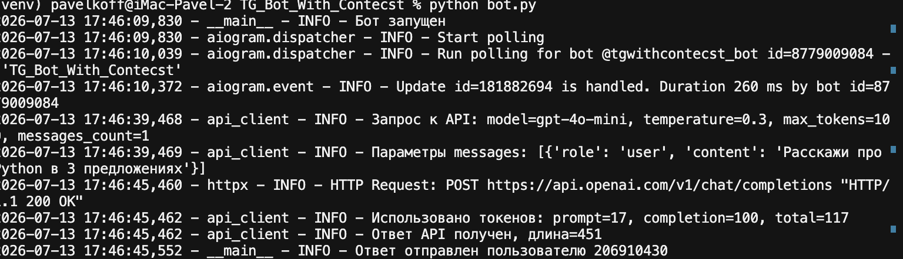
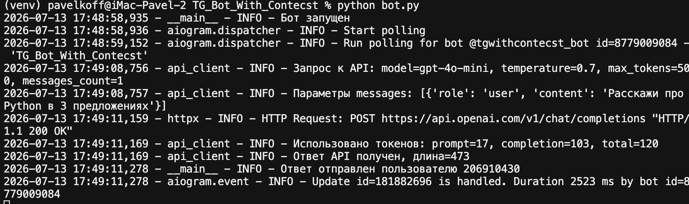
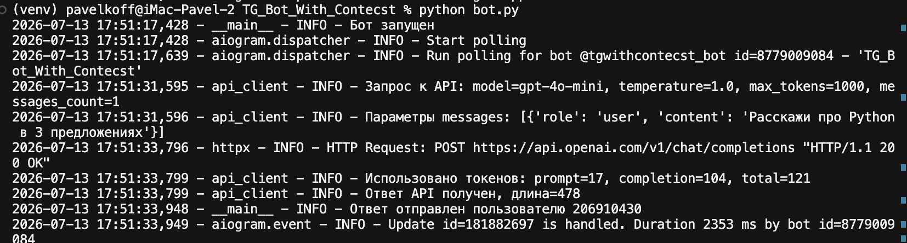
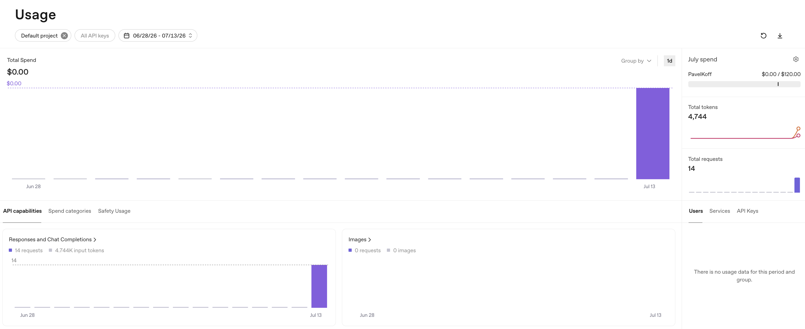

# TG Bot With Context

Telegram-бот с поддержкой контекста диалога на базе aiogram и OpenAI API.

## Структура проекта

```
TG_Bot_With_Contecst/
├── venv/                 # Виртуальное окружение Python
├── .env                  # Переменные окружения (не коммитить)
├── bot.py                # Точка входа, обработчики Telegram
├── config.py             # Загрузка настроек из .env
├── config_example.txt    # Пример конфигурации
├── context_manager.py    # Хранение истории сообщений
├── api_client.py         # Клиент OpenAI API
├── requirements.txt      # Зависимости
└── run.sh                # Скрипт запуска (macOS)
```

## Установка (macOS)

1. Перейдите в папку проекта:

```bash
cd ~/Desktop/TG_Bot_With_Contecst
```

2. Создайте виртуальное окружение:

```bash
python3 -m venv venv
```

3. Активируйте его:

```bash
source venv/bin/activate
```

4. Установите зависимости:

```bash
pip install -r requirements.txt
```

5. Скопируйте `config_example.txt` в `.env` и укажите токены:

```bash
cp config_example.txt .env
```

Откройте `.env` в редакторе и вставьте свои токены.

## Запуск

```bash
source venv/bin/activate
python bot.py
```

Или одной командой:

```bash
chmod +x run.sh
./run.sh
```

## Команды бота

- `/start` — начать диалог
- `/help` — показать справку
- `/clear` — очистить контекст диалога
- `/reset` — очистить контекст диалога
- `/stats` — показать статистику
- `очистить контекст` — очистить историю (текстом)

---

## Короткий отчёт

### Тестирование параметров модели

Для каждого прогона меняйте `TEMPERATURE` и `MAX_TOKENS` в `config.py`, перезапускайте бота и задавайте один и тот же вопрос, например: *«Расскажи про Python в 3 предложениях»*.

Токены смотрите в логах или в [OpenAI Usage](https://platform.openai.com/usage).

**Ориентировочная стоимость gpt-4o-mini:**
- вход: ~$0.15 / 1M токенов
- выход: ~$0.60 / 1M токенов

| Модель | temperature | max_tokens | № прогона | Эффект (сжатость / креатив) | Токены (вход / выход) | ~Стоимость |
|--------|-------------|------------|-----------|-----------------------------|------------------------|------------|
| gpt-4o-mini | 0.3 | 100 | 1 | Сжато, обрезано на лимите 100 токенов | 17 / 100 | ~$0.000063 |
| gpt-4o-mini | 0.7 | 500 | 2 | Сбалансированно, полный ответ за 3 предложения | 17 / 103 | ~$0.000064 |
| gpt-4o-mini | 1.0 | 1000 | 3 | Чуть разнообразнее, длина ответа схожа | 17 / 104 | ~$0.000065 |

**Вопрос для всех прогонов:** «Расскажи про Python в 3 предложениях»

**Скрины логов прогонов:**





**Формула стоимости:**
```
стоимость ≈ (входные_токены × 0.15 + выходные_токены × 0.60) / 1_000_000
```

### Скрин Usage / ID запросов

Скриншот использования API из [OpenAI Usage](https://platform.openai.com/usage):



**Итого за 13.07.2026:** 14 запросов, 4 744 токена, $0.00 (бесплатный лимит).

Экспорт данных: `docs/completions_usage_2026-06-13_2026-07-13.csv`

### Выводы

- При **temperature 0.3** и **max_tokens 100** ответ обрезается на лимите — самый сжатый вариант.
- При **temperature 0.7** ответ полный и сбалансированный — оптимально для бота.
- При **temperature 1.0** ответ чуть длиннее и разнообразнее, но на коротком вопросе разница минимальна.
- Расход токенов на один запрос: **117–121** (~$0.00006).

